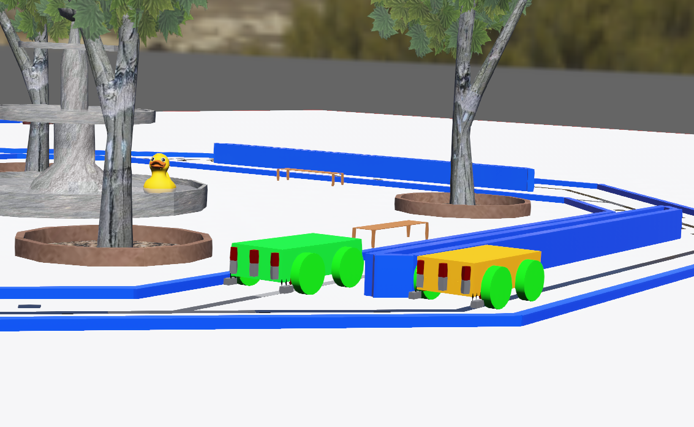
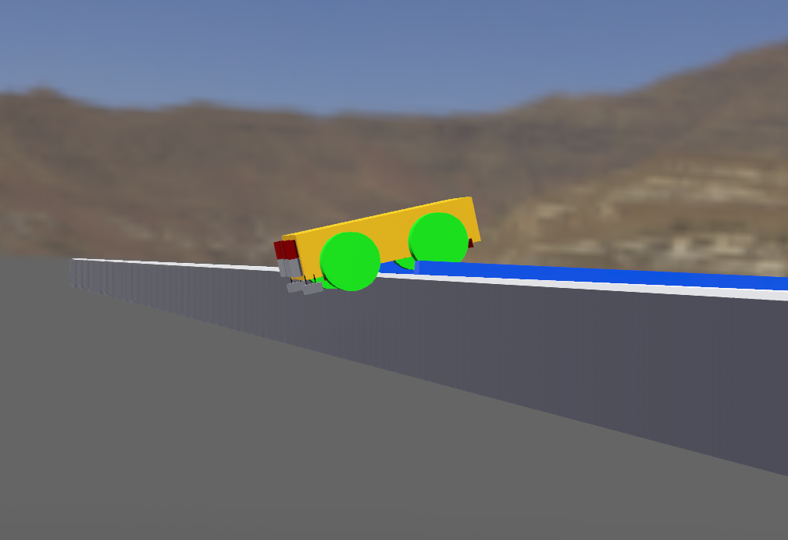
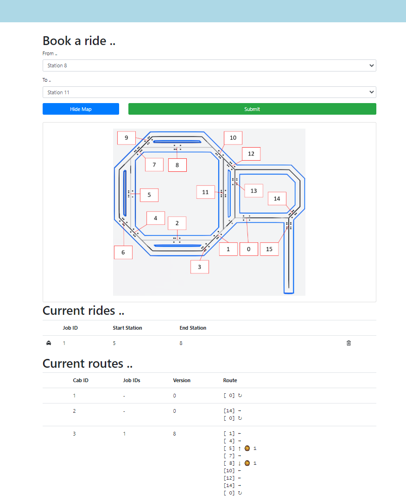
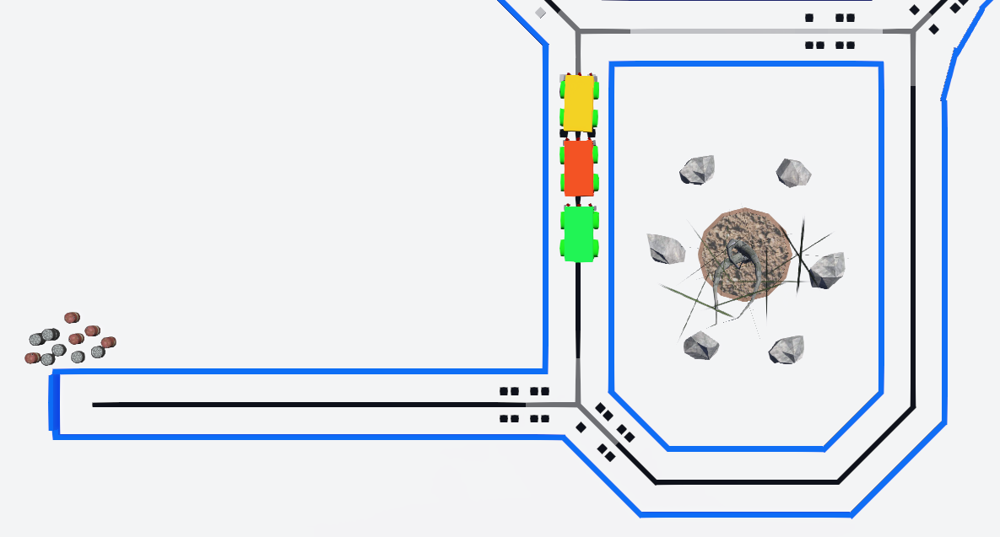
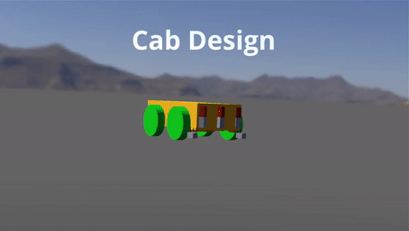
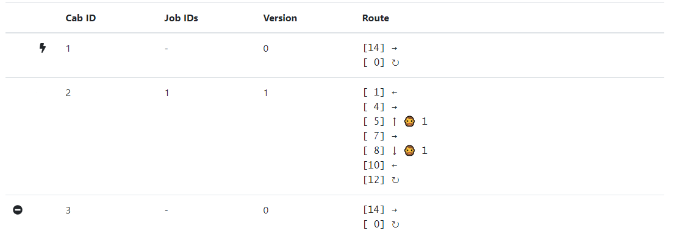

# Cab Service No. 1

**Group members**: 

* Florentin Ehser
* Julian Hartmer
* Chanki Hong
* Maximilian Weisenseel
* Christopher Woggon

## Project overview
In restless effort we created nothing less than the next generation of self driving cabs.  By accelerating bleeding edge simulation software paired with up to date academic insights we were able to reach the ultimate goal of level 5 autonomous driving.

### Goals
We focused on the two things customers actually care about:

* Safety
* Customer Experience

What about design? Well, I'd rather arrive on-time in one of our cabs than five minutes late and probably dead in a beautifully designed Tesla.

### Requirements
List the **necessary** and **optional** requirements that were set for your project.

#### Boring Standard Requirements (skip):

- [x] complete autonomous driving cabs
- [x] pickup and drop-off only at the designated stations
- [x] Use only: camera, ultrasonic and infrared sensors
- [x] at least two cabs
- [x] Environment has to contain:
  - [x] only one-way connections
  - [x] a depot
  - [x] at least four pick-up locations
  - [x] a rubber duck

#### Safety:

- [x] Cab has to be in a **safe state** at any point in time
- [x] Handling of communication and sensor failures

#### Customer Experience:

- [x] simple booking process
- [x] minimal wait and travel time

### Approach
#### Safety:

- Multiple fallback layers
- Excessive testing and formal verification

#### Customer Experience

- State-of-the-art booking website
- Route and job assignment optimizations

## System architecture
### Software design

#### Webots Controller

Responsible for providing sensor data and setting received motor values.

#### External Controller

Receives sensor data from the Webots Controller and the route from the Backend. Than calculates based on these the motor values which are then sent back to the Webots Controller.

#### Backend

Receives the positions of all cabs. Assigns the Jobs to the cabs and provides them with a precalculated route.

### Environment design

#### Lane

Our cabs navigate through the environment by following the roads middle lane.
The lane also has different levels of roughness to dictate further cab behaviour;
for example: "turn left here".

#### Curbs

Our roads are surrounded by curbs to enhance the our cabs ability to stay on the road.

#### Road Marker

We use a combination of eight squares on the road to mark special positions. 
These so called "Road Marker" have four squares to indicate that at this position is a road marker
and additional four squares to decode the associated number of the road marker.

#### Stations

Our environment contains four stations where pick up and drop off is possible.

#### Depot

We include a depot where the cabs spend their time waiting for new jobs. 

##### Workshop

In the workshop we store cabs that require investigation.

### Robot design

#### Features

##### Front Distance

We use ultrasonic and infrared sensors to detect obstacles in front of the robot. 
This status is also sent to the backend. This way the other cabs can take an alternative route.

##### Curb Detection

The cab is also equipped with a pair of **retractable** distance sensors. These measure the distance to the blue curbs
which embed the road.  

##### Lane Detection

Our cab uses three infrared sensor underneath to detect the lane, which indicates the driving path. Additional to the lane
itself we use the roughness to specify additional commands. For example to instruct the cab to turn left at specific positions.

##### Road Markers

We use four infrared sensors to detect the Road Markers and four additional infrared sensors to decode the number of the Road Marker.

### Algorithms

#### Route handling

The Backend calculates the routes for all cabs. These routes include possible jobs and a way back to the depot. 

Additional to the current position the cabs send status information.
Blocked: \Documents\git\sese-cab-service\documentation\Website\images\blocked.png)
Not Functional: \Documents\git\sese-cab-service\documentation\Website\images\not functional.png)
In both cases the Backend wont assign jobs to these cabs. 

If a cab is Blocked the backend will consider this planning the route for the other cabs. 
In this example is cab 3 blocking the depot.
Consequently, cab 2 received a route in which it will wait at Road Marker twelve until the Depot is no longer blocked.

#### Safe State

Based on the paper: ["Fault-Tolerance by Graceful Degradation for Car Platoons"](https://www.researchgate.net/publication/332072423_Fault-Tolerance_by_Graceful_Degradation_for_Car_Platoons), we designed a degeneration controller for our cab.

##### Sensor Errors

We equipped our cab with a backup sensor for every functionality. For example in case the "Sensor Error (IR)" occurs **both** Infrared Front Distance Sensors have failed. We omitted this in this diagram to keep it as small as possible.

##### States

We defined four different levels of errors.

###### Red: Critical Errors

**Front Distance Error:** None of the front distance errors is functional; the cab will stop immediately.

**Final Safe State:** Whether Lane detection nor Curb Detection is possible; the cab will leave the road network, since further navigation is not possible

###### Orange: Serious Errors

The cab returns to the workshop for further investigation

###### Yellow: Medium Errors

The cab finishes its current route and then return to the depot to wait until the connection to the backend has been re-established

###### Green: Minor Errors

The malfunctioning feature can be replaced by a backup functionality.  

## Summary

Even though two members left our project, we were able to reach all of our mandatory and optional  goals.

### Lessons learned

Since it is quite hard to just google problems in Ada, we had to understand and solve the problems on our own leaving us with a deeper understanding of the programming language. 

In general we are satisfied with the choices we made and the way we managed our time. If we could start all over again with an additional team member we would include the camera, to add another backup layer to our system.

### Future work
As always, time is short and we have many ideas just waiting for implementation:

- [ ] Extend the formal verification of the project
- [ ] Include the camera
- [ ] Optimize ridesharing

